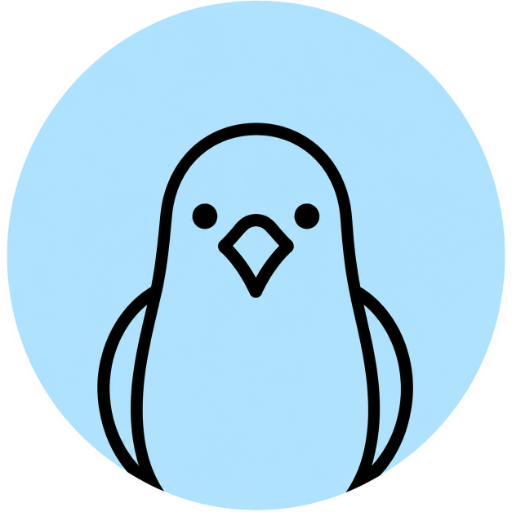

<p align="center">
  
</p>

<h1 align="center">magpie</h1>

<p align="center"><em>give it a name, it brings back the vulnerabilities</em></p>

<p align="center">A Software Composition Analysis (SCA) server: hand it a package URL and it gathers, matches, and groups the known vulnerabilities for that component.</p>

<p align="center">
  <a href="https://cafecito.app/ezequielcamezzana"></a>
</p>

---

> [!WARNING]
> **magpie is alpha and built for research purposes.** It works and is useful today, but the data model still moves and coverage is uneven across ecosystems. Expect rough edges.

## What it does

Give magpie a [purl](https://github.com/package-url/purl-spec) and it runs the `collect.Collect` pipeline:

1. **Collect** — queries upstream sources ([ecosyste.ms](https://ecosyste.ms), [OSV](https://osv.dev), [NVD](https://nvd.nist.gov)) for the component and its known vulnerabilities.
2. **Match** — resolves affected version ranges and CPEs against the requested version. CPE resolution reads NVD's CPE configurations by CVE through [VulnCheck](https://vulncheck.com)'s NVD2 index.
3. **Group** — deduplicates and groups vulnerabilities by their canonical CVE.
4. **Persist** — stores components, CPEs, and vulnerabilities in SQLite.

It exposes an HTTP API (built on [chi](https://github.com/go-chi/chi)) and an embedded single-page app for browsing the results.

## Quickstart

```sh
# build the binary into ./bin/magpie
make build

# run the server (listens on :8080, DB at ./magpie.db)
./bin/magpie server
```

The root `/` serves the landing site; the SPA lives at `http://localhost:8080/app`.

Trigger a collection from the API:

```sh
curl 'http://localhost:8080/collect?purl=pkg:npm/lodash@4.17.20'
```

`magpie version` prints the version, commit, and build date.

## Configuration

All configuration is read from environment variables. See [`.env.example`](.env.example).

| Variable | Default | Description |
|---|---|---|
| `MAGPIE_ADDR` | `:8080` | Address the HTTP server listens on |
| `MAGPIE_DB_PATH` | `./magpie.db` | Path to the SQLite database file |
| `MAGPIE_LOG` | _(empty)_ | Log format (empty = text, `json` = structured) |
| `NVD_API_KEY` | _(empty)_ | NVD API key (raises rate limits for by-CPE NVD vuln matching) |
| `VULNCHECK_API_KEY` | _(empty)_ | VulnCheck API token; required for CPE resolution (by-CVE NVD2 lookups). Empty disables CPE resolution |
| `MAGPIE_MAX_AGE` | `24h` | Max age before cached source data is refreshed |
| `MAGPIE_REQUEST_TIMEOUT` | `30s` | Per-request timeout for the HTTP API |

Durations use Go's [`time.ParseDuration`](https://pkg.go.dev/time#ParseDuration) syntax (`30s`, `24h`, …); an invalid value falls back to the default.

## API

All endpoints are served at the root and accept query parameters.

| Method | Path | Purpose |
|---|---|---|
| `GET` | `/collect` | Run the collect pipeline for a `purl` and persist the result |
| `GET` | `/vulnerabilities` | List stored vulnerabilities |
| `GET` | `/vulnerability` | Fetch a single vulnerability |
| `GET` | `/components` | List stored components |
| `GET` | `/component` | Fetch a single component |
| `GET` | `/cpes` | List stored CPEs |
| `GET` | `/` | The landing site (what magpie is and how it works) |
| `GET` | `/app` | The embedded single-page app |

## Development

Common `make` targets:

| Target | What it does |
|---|---|
| `make build` | Build the binary into `./bin/magpie` |
| `make run` | Run the server from source |
| `make test` | Run the full test suite |
| `make vet` | Static analysis (`go vet ./...`) |
| `make fmt` | Format the code (`go fmt ./...`) |
| `make tidy` | Tidy `go.mod` / `go.sum` |
| `make ui-sync` | Copy the shared design system into the embedded UI assets |

## Documentation

- [How magpie works](docs/architecture.md) — the collect pipeline, caching, and package layout.

## Contributing

Issues and PRs are welcome — see [CONTRIBUTING.md](CONTRIBUTING.md). For security issues, **do not** open a public issue; see [SECURITY.md](SECURITY.md).

## Contact

Questions, feedback, or issues — email **ezequielcamezzana@gmail.com**.

## License

[Apache License 2.0](LICENSE).
